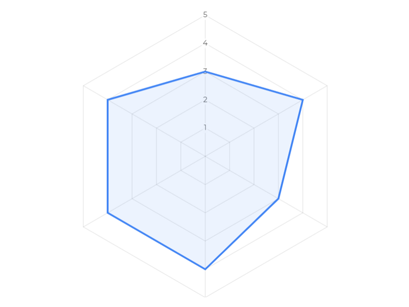

# Radar Chart
A radar chart community visualization for Looker Studio using the Chart.js library

Looker Studio [community visualizations][community viz] allow you to write custom
JavaScript visualizations for [Looker Studio][lookerstudio].

This [radar chart] community visualization built with [Chart.js][chartjs] takes 1 dimension and up to 20 metrics. It works best with metrics of the same scale and range.

## Deployed version

See a demo of the visualization [deployed].

## Authors

This code was written by Marc Soares.

[community viz]: https://developers.google.com/looker-studio/visualization
[lookerstudio]: https://lookerstudio.google.com
[radar chart]: https://en.wikipedia.org/wiki/Radar_chart
[chartjs]: https://www.chartjs.org/
[deployed]: https://lookerstudio.google.com/s/gjBSaPk0ViU
